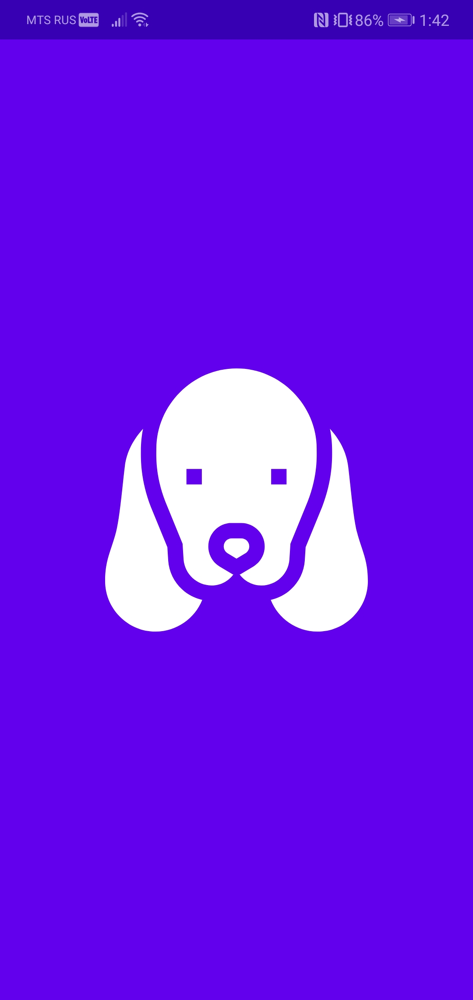
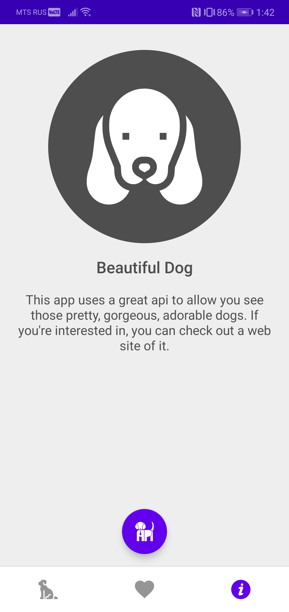
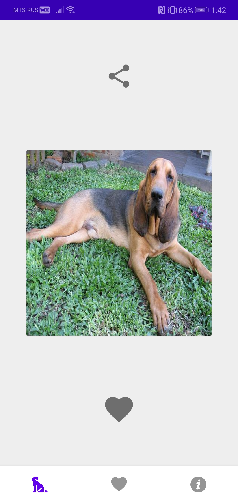
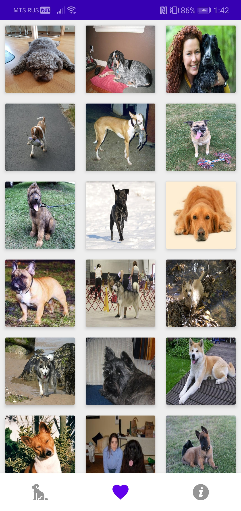
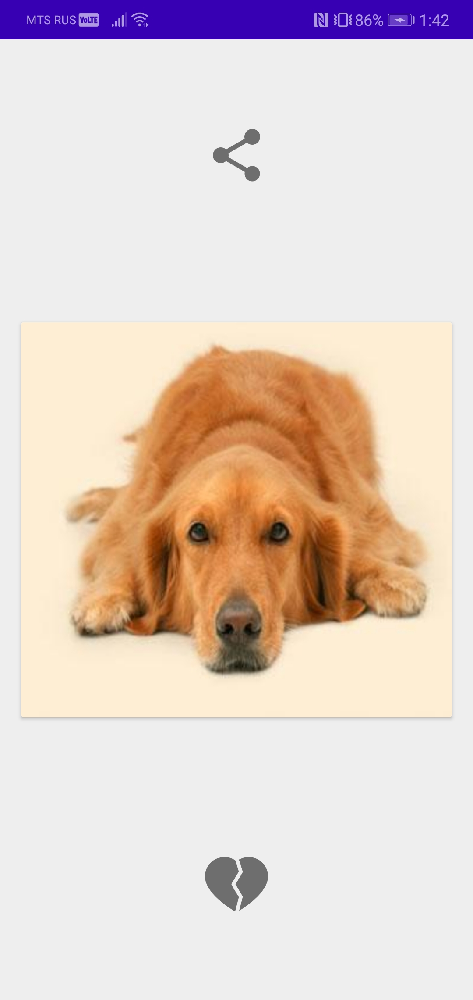

# BeautifulDog

## Idea
Very simple app that you can use to see a random dog picture, save it if you like or share it with your friends. 
It uses [dog.ceo](https://dog.ceo/dog-api/) api to get photos.
Even though it's an android app, all bussiness logic is written using kotlin multiplatform.

## How it looks

 

## What it uses
### Data
- [SQLDelight](https://github.com/cashapp/sqldelight) - multiplatform sqlite database orm.
- [Ktor](https://ktor.io/) - multiplatform http client.
- [kotlinx.serialization](https://github.com/Kotlin/kotlinx.serialization) - multiplatform serialization lib.
### Android Architecture Components
- [LiveData](https://developer.android.com/topic/libraries/architecture/livedata)
- [ViewModel](https://developer.android.com/topic/libraries/architecture/viewmodel)
- [Navigation](https://developer.android.com/guide/navigation/navigation-getting-started)
### Dependency Injection
- [Koin](https://insert-koin.io/)
### Concurrency
- [Coroutines suspend functions](https://kotlinlang.org/docs/reference/coroutines/basics.html)
- [Coroutines Flow](https://kotlinlang.org/docs/reference/coroutines/flow.html)
### UI
- [Motion Layout](https://developer.android.com/training/constraint-layout/motionlayout) 
- [Material Components](https://github.com/material-components/material-components-android)
